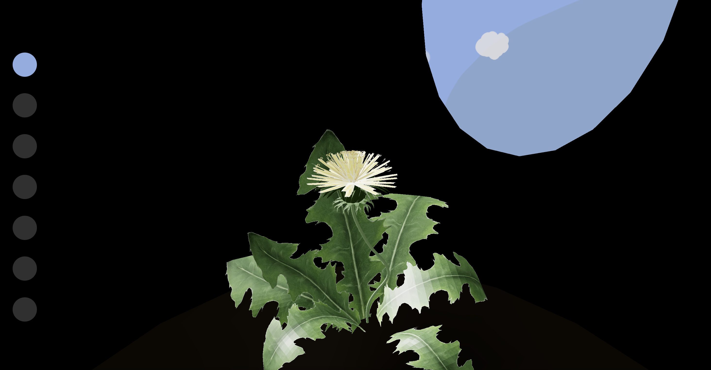

# Sleeping Dandelion

This project was bootstrapped with [Create React App](https://github.com/facebook/create-react-app).

## Available Scripts

In the project directory, you can run:

### `npm start`

Runs the app in the development mode.\
Open [http://localhost:3000](http://localhost:3000) to view it in your browser.

## Concept

Dandelion that grows according to the  days of the week. The passage of time can be seen from the entrance of the tree hollow as the sun and moon move across the sky.

The project is still undergoing.

